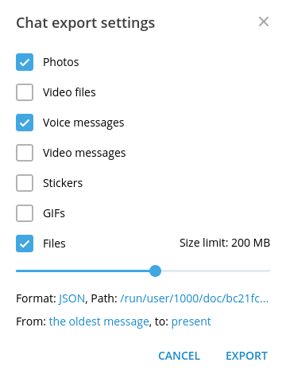

# tg2md

This script parses output from Telegram channel and converts each post to 
jekyll-applicable post in markdown.

Telegram Desktop creates JSON file, as well as different directories containing
multimedia, photos, etc. This script creates new directory and populates it with
formatted posts ready to publish.

## basic usage

Firstly you need to export your channel history from Telegram Desktop app.
This could be done from three dots menu. Then popup menu appears, where
you can choose what data you want to export. The script currently supports
only photos, voice messages and audio files.



In format menu you should specify 'Machine-readable JSON' file and then
locate to directory of your desire.

To convert your posts to markdown files you need to copy `parse.py` file into
your export folder and run it there.

```console
$ cp parse.py /path/to/export/dir
$ cd /path/to/export/dir
$ python parse.py
```

Currently there's no way to change name of ouput folder other than directly
editing the script. By default it's creating directory `formatted_posts` with
markdown files in there.

Also if your jekyll directory storing media files in folders other than `photos`
and `files`, you should change `photo_dir` and `media_dir` variables.

## todo's

- use argparse module instead of crap
- replies
- single/muliple tags
- forwarded posts
- custom post header
